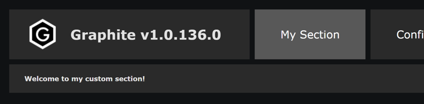
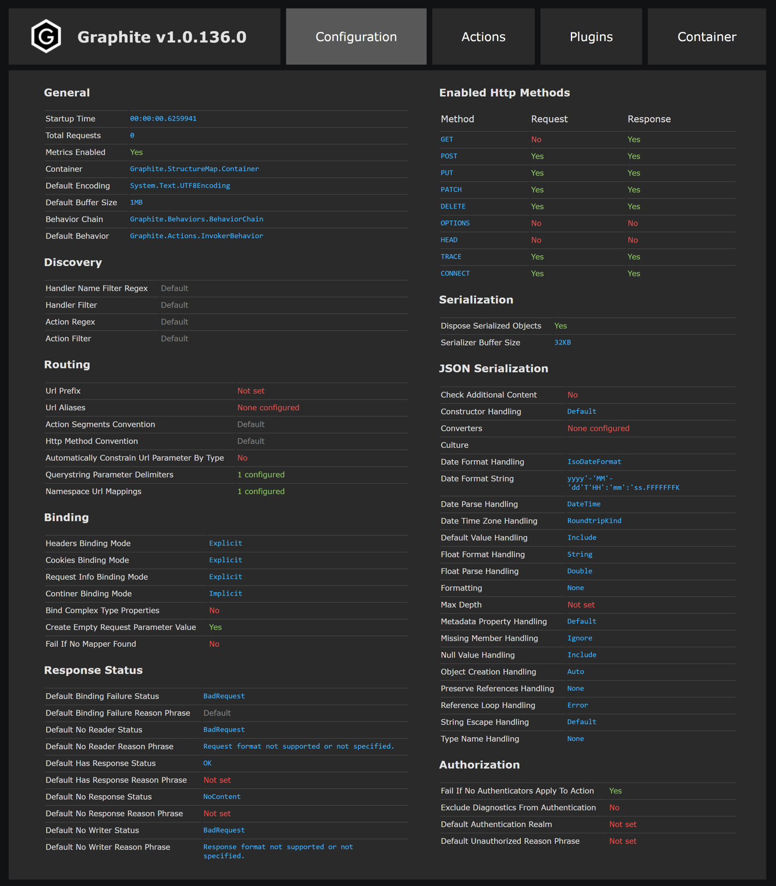
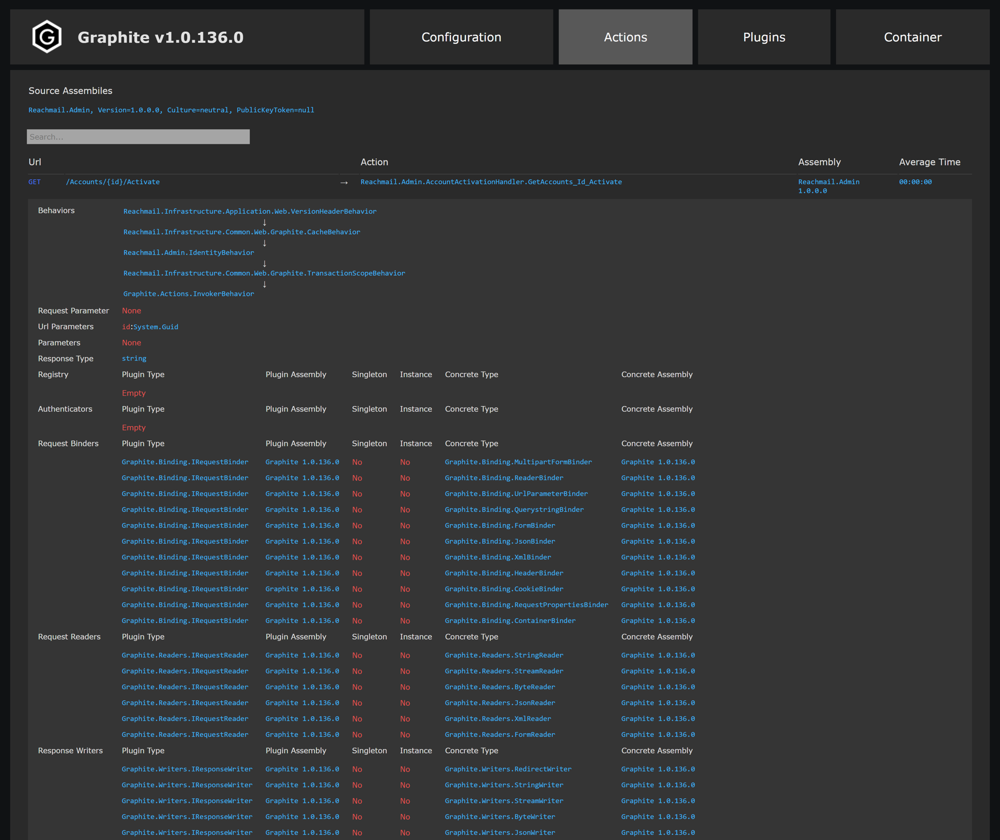
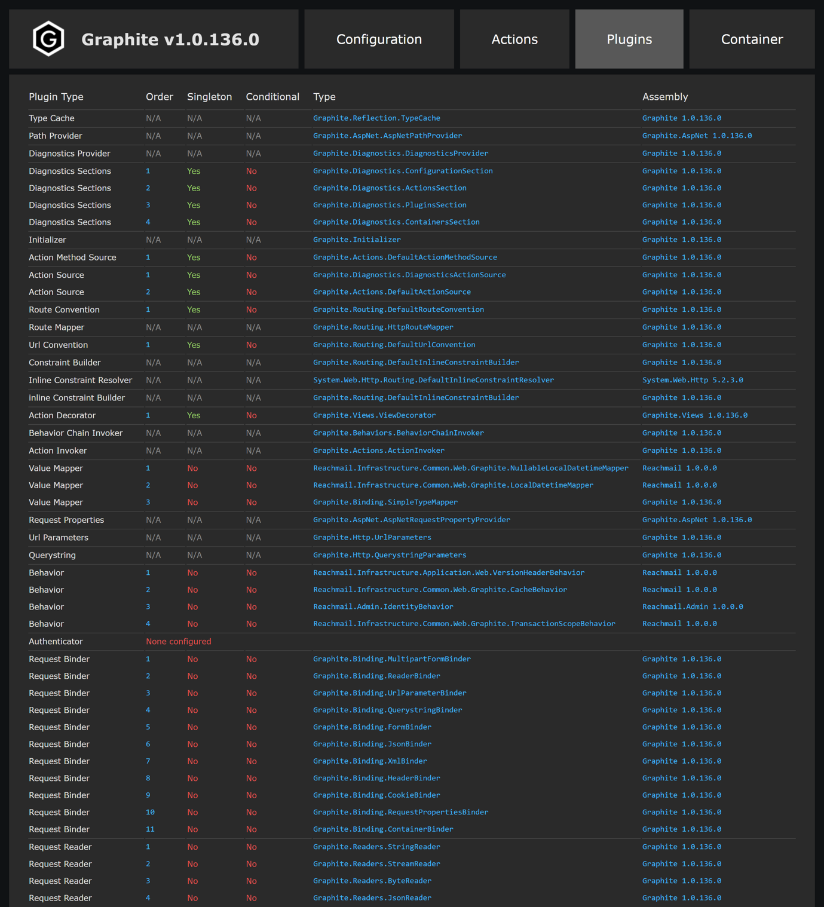
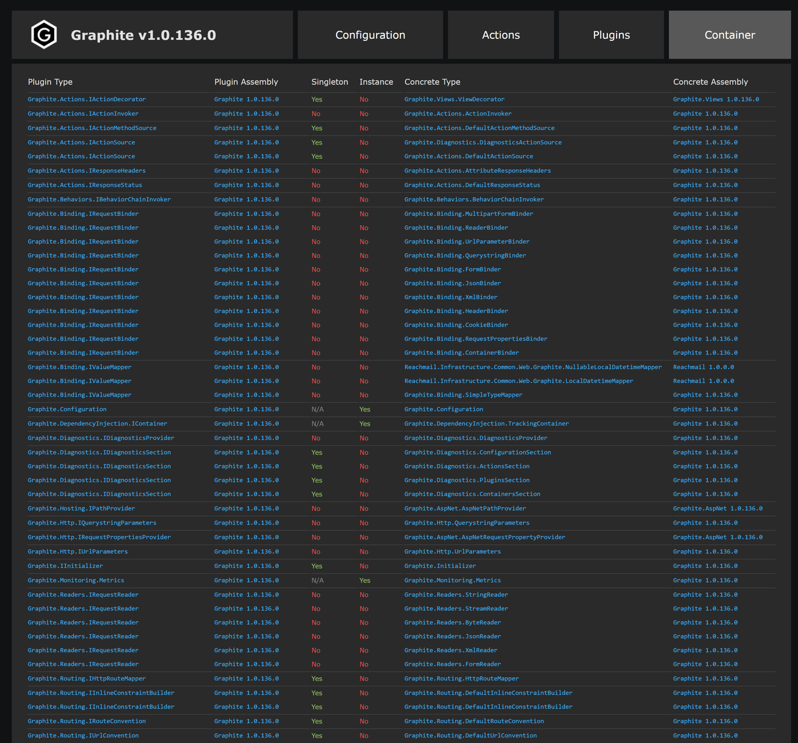

## Diagnostics

Graphite ships with diagnostics that display the current state of the application. The diagnostics can be enabled a fews ways. First, you can simply enable them:

```csharp
.InitializeGraphite(g => g
    .EnableDiagnostics()
```

Leaving diagnostics enabled in production is not recommended so you can also enable diagnostics when a type assembly is in debug mode:

```csharp
.InitializeGraphite(g => g
    .EnableDiagnosticsInDebugMode<Global>()
```

By default the diagnostics url is `/_graphite`. You can change this as follows:

```csharp
.InitializeGraphite(g => g
    .WithDiagnosticsAtUrl("debug/diagnostics")
```

If you are using the built in authentication you can also exclude the diagnostics page so this can be accessed without authenticating:

```csharp
.InitializeGraphite(g => g
    .ExcludeDiagnosticsFromAuthentication()
```

### Extending Diagnostics

The diagnostics page can be extended by adding sections. Sections implement `IDiagnosticsSection` or inherit from the base class `DiagnosticsSectionBase`. These have one method `Render()` that returns HTML. 

```csharp
public class MyCustomSection : DiagnosticsSectionBase
{
    public MyCustomSection() : base("My Section") { }

    public override string Render()
    {
        return "<b>Welcome to my custom section!</b>";
    }
}
```

Then you can register the section as follows:

```csharp
.InitializeGraphite(c => c
    .ConfigureDiagnosticsSections(x => x
        .Prepend<MyCustomSection>()));
```
This will display the following under diagnostics:



### Configuration Section

The first section under diagnostics is configuration. This page displays all the Graphite configuration.



### Actions Section

The second section under diagnostics is actions. This page displays all the Graphite routes and actions. You can search these in the search box at the top.



### Plugins Section

The third section under diagnostics is plugins. This page displays all the configured Graphite plugins.



### Container Section

The last section under diagnostics is container. This page displays all the IoC container registrations.

