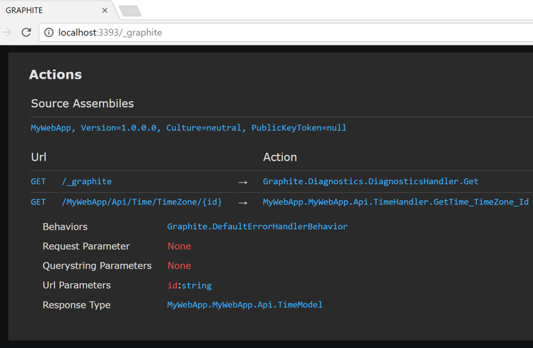
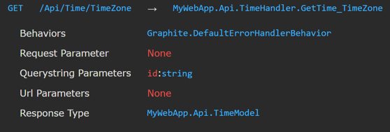
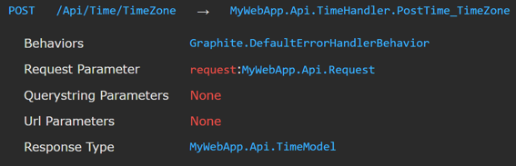

### Getting Started

You can either start out with a new empty web project or with an existing one as Graphite can coexist with your existing Web Api controllers. Graphite only supports .NET 4.6.2 or later.

Install the packages for your host; ASP.NET:

```bash
PM> Install-Package Microsoft.AspNet.WebApi.WebHost
PM> Install-Package GraphiteWeb.AspNet
```

Or OWIN:

```bash
PM> Install-Package Microsoft.AspNet.WebApi.OwinSelfHost
PM> Install-Package GraphiteWeb.Owin
```

Next, install the IoC container. Currently Graphite only supports StructureMap out of the box, but other IoC containers can be plugged in.

```bash
PM> Install-Package GraphiteWeb.StructureMap
```

Next we will bootstrap Graphite by adding the following to the `Global.asax` for ASP.NET:

```csharp
public class Global : HttpApplication
{
    protected void Application_Start(object sender, EventArgs e)
    {
        GlobalConfiguration.Configure(c => c
            .InitializeGraphite(g => g
                // Required
                .IncludeTypeAssembly<Global>()
                .UseStructureMapContainer()
                // Optional
                .EnableDiagnosticsInDebugMode<Global>()
                .ConfigureNamespaceUrlMapping(u => u
                    .MapNamespaceAfter<Global>())));
    }
}
```

Or the startup class for OWIN:

```csharp
public class Program
{
    static void Main(string[] args)
    {
        WebApp.Start<Startup>(args[0]);

        Console.WriteLine($"Server running at {args[0]}, press enter to exit.");
        Console.ReadLine();
    }
}

public class Startup
{
    public void Configuration(IAppBuilder appBuilder)
    {
        appBuilder.InitializeGraphite(g => g
            // Required
            .IncludeTypeAssembly<Startup>()
            .UseStructureMapContainer()
            // Optional
            .EnableDiagnosticsInDebugMode<Startup>()
            .ConfigureNamespaceUrlMapping(u => u
                .MapNamespaceAfter<Startup>());
    }
}
```

The first option specifies the assembly to search for handlers and actions. The second configures Graphite and Web Api to use the same StructureMap container. The third enables the diagnostics page when in debug mode. And the last configures a url convention. All of these will be discussed further below.

By default, Graphite will accept and return JSON and XML through content negotiation. It uses Json.NET and the FCL XML serializer by default. You can configure serializers by configuring readers and writers. Let's say for example we *don't* want to support XML:

```csharp
.InitializeGraphite(g => g
    .ConfigureRequestReaders(r => r.Remove<XmlReader>())
    .ConfigureResponseWriters(r => r.Remove<XmlWriter>())
    ...);
```

Next we'll write our first handler and action. Graphite handlers are analogous to Web Api controllers although they are a bit different. Handlers are simply POCO's with a name that ends with `Handler` and one or more actions with a name that begins with an HTTP verb (e.g. `Get`, `Post`, `Patch`, `Put`, `Delete`, etc.) By default actions are passed and return POCO models and/or simple types. For example, a handler with an action that returns the current time in a particular timezone:

```csharp
namespace MyWebApp.Api
{
    public class TimeModel
    {
        public DateTime Time { get; set; }
    }

    public class TimeHandler
    {
        public TimeModel GetTime_TimeZone_Id(string id)
        {
            return new TimeModel
            {
                Time = TimeZoneInfo.ConvertTime(DateTime.Now,
                    TimeZoneInfo.FindSystemTimeZoneById(id))
            };
        }
    }
}
```

The url for the action is determined by the conventions you specify in the configuration but we'll discuss the default conventions here. The HTTP verb is determined by the action method name prefix, which in this case is `Get`. The url for this action is built as follows:

1. The handler namespace split by `.`.
2. The method name minus the verb prefix, split by `_`. Segments that match the name of an action parameter are considered url parameters.

So by default:

1. Namespace `MyWebApp.Api` --> `MyWebApp/Api`
2. Action `GetTime_TimeZone_Id` --> `Time/TimeZone/{id}`

These are concatenated, so the verb and url for this action would be `GET /MyWebApp/Api/Time/TimeZone/{id}`. 

We really don't want `MyWebApp` in our url so we can start the url after the namespace of the `Global.asax` class:

```
.InitializeGraphite(g => g
    .ConfigureNamespaceUrlMapping(u => u
        .MapNamespaceAfter<Global>());
```

This will exclude the namespace of the `Global` class, i.e. `MyWebApp`, from the url, producing `/Api/Time/TimeZone/{id}` instead.

**NOTE:** Since Graphite does not include the handler name in the url, it is possible that the url could match a physical path under the website. By default IIS will not route existing directories and files so if the url does match, your route will likely just return a `403`. To allow route urls to match physical paths, add the following to the Graphite configuration:

```csharp
.InitializeGraphite(g => g
    .ConfigureWebApi(w => w
        .RouteExistingFiles());
```

Conventions do a lot of magic and it can be difficult, especially at first, to know what they are doing. This is why Graphite ships with diagnostics out of the box. There you can see all your configuration and actions. By default the diagnostics url is `/_graphite`, simply start your web project and browse to that url. You can see our time action below:



Now lets see how you can pass querystring values and send data. 

First lets pass the time zone id as a querystring parameter. All that needs to be done is to remove `_Id` from the action method name. Now that the parameter name no longer matches a url segment, it is considered to be an action parameter. Action parameters can be bound to querystring parameters or other request values like cookies and headers (although by default only querystring parameters are bound to action parameters, others need to be enabled in the configuration before they will be bound).

```csharp
public class TimeHandler
{
    public TimeModel PostTime_TimeZone(string id)
    {
        return new TimeModel
        {
            Time = TimeZoneInfo.ConvertTime(DateTime.Now,
                TimeZoneInfo.FindSystemTimeZoneById(id))
        };
    }
}
```

The verb and url for this action would now be `GET /Api/Time/TimeZone?id={id}`. 



Next, lets `POST` the timezone code instead passing it through a url parameter. To do this we change the action method name to start with `Post` and make the first parameter an input model:

```csharp
public class Request
{
    public string Id { get; set; }
}

public class TimeModel
{
    public DateTime Time { get; set; }
}

public class TimeHandler
{
    public TimeModel PostTime_TimeZone(Request request)
    {
        return new TimeModel
        {
            Time = TimeZoneInfo.ConvertTime(DateTime.Now,
                TimeZoneInfo.FindSystemTimeZoneById(request.Id))
        };
    }
}

```

By default the first action parameter is assumed to be the request on verbs that accept a request (e.g. `POST`, `PUT`, `PATCH`, etc.). The verb and url for this action would now be `POST /Api/Time/TimeZone`.

 

Well, that covers the basics! What we've covered so far is pretty much all you need to know in order to use Graphite day-to-day. Of course, you'll probably want to customize and extend the framework. The topics to the left cover that in detail.

### Next: [Bootstrap](bootstrap)