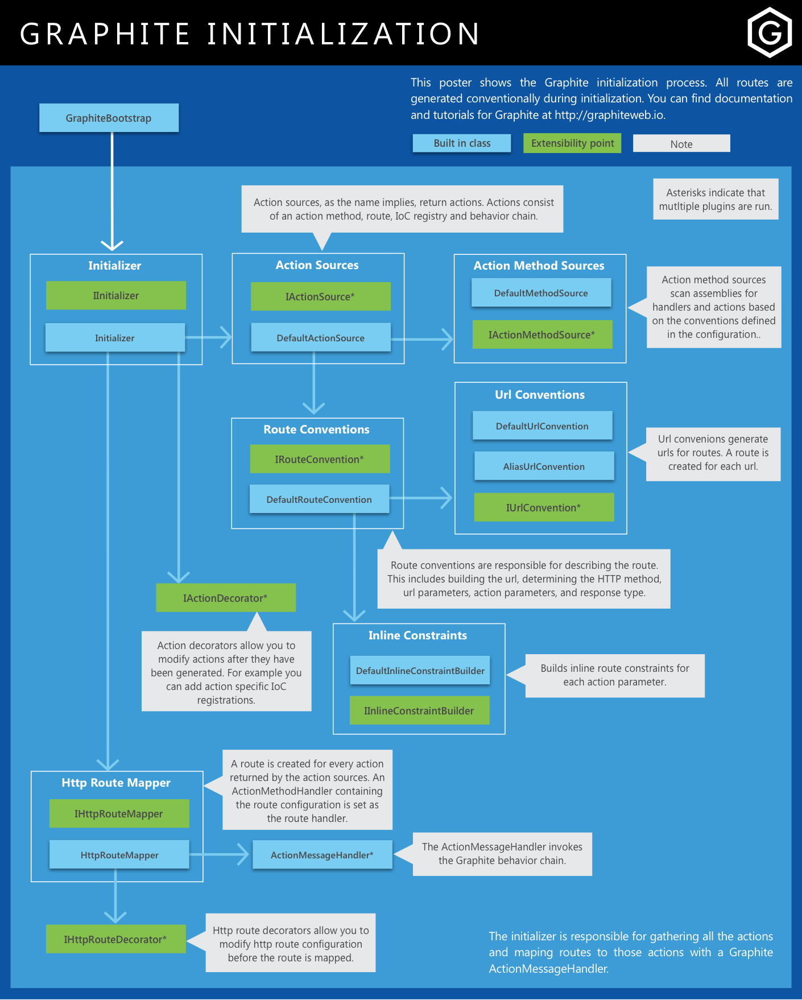

### Initialization

The following graphic illustrates the Graphite initialization flow:

[](img/initialization.png)

### Initializer

The initializer coordinates the discovery of actions and the creation of routes based on those actions. The Initializer implements `IInitializer` and has one method, `Initialize`: 

```csharp
public class MyCustomInitializer : IInitializer
{
    public void Initialize()
    {
        ...
    }
}
```

It can be overriden by a custom implementaion in the configuration as follows:

```csharp
.InitializeGraphite(g => g
    .WithInitializer<MyCustomInitializer>());
```

### Action Sources

As mentioned earlier, the initializer searches for Graphite actions. To do this it uses action sources. 

#### Default Action Source

Graphite automatically registers the `DefaultActionSource`. The default action source coordinates the discovery of action methods (with configured action method sources, discussed below) and generating the route information with the configured route conventions. 

#### Custom Action Sources

The default action source will be sufficient for most applications but in some scenarios it may make more sense to dynamically generate actions. In these scenarios you have two options, you can roll your own low level action sources or higher level action method sources. The former is demonstrated below and the latter is discussed in the next section.

Action sources implement `IActionSource` and have two methods, `Applies` and `GetActions`. 

```csharp
public class MyActionSource : IActionSource
{
    private readonly ITypeCache _typeCache;

    public MyActionSource(ITypeCache typeCache)
    {
        _typeCache = typeCache;
    }
    
    public bool Applies()
    {
        return true;
    }

    public List<ActionDescriptor> GetActions()
    {
        var actionMethod = _typeCache.GetTypeDescriptor(typeof(SomeHandler))
            .Methods.First(x => x.Name == "SomeAction");
        var parameters = actionMethod.MethodDescriptor.Parameters;
        var urlParameters = new List<UrlParameter>
        {
            new UrlParameter(new ActionParameter(actionMethod, parameters[1]), false)
        };
        var querystring = new List<ActionParameter>
        {
            new ActionParameter(new ActionParameter(actionMethod, parameters[2]))
        };
        var requestParameter = parameters[0];
        var responseType = actionMethod.MethodDescriptor.ReturnType;
        return new List<ActionDescriptor>
        {
            _actionDescriptorFactory.CreateDescriptor(actionMethod,
                new RouteDescriptor(HttpMethod.Get.Method, "/some/url", 
                    urlParameters, querystring, requestParameter, responseType))
        };
    }
}
```

As you can see, the action source is low level. It gives you full control over the resulting actions but requires more work. If you don't require this much control, but still want to dynamically generate actions, create a custom action method source instead (see below).

Graphite allows you to register multiple action sources and will combine actions from all action sources. 

```csharp
.InitializeGraphite(g => g
    .ConfigureActionSources(as => as
        .Append<MyActionSource>()
        .Append<AnotherActionSource>(a => a
            .ActionMethod.HasAttribute<SomeAttribute>())));
```

### Action Method Sources

As mentioned above, the default action source discovers action methods with the configured action method sources. Action method sources enumerate handler methods. They do the actual work of looking through configured assemblies for handlers and action methods. 

#### Default Action Method Source

Graphite automatically registers the `DefaultActionMethodSource`. The default action method source searches for action methods based on the configured conventions as follows... 

##### Assemblies

By default, configured assemblies are searched for handlers and action methods. These must be specified in the Graphite configuration.  

```csharp
.InitializeGraphite(g => g
    .IncludeTypeAssembly<Global>()
    .IncludeTypeAssemblies(typeof(Global))
    .IncludeAssemblies(typeof(Global).Assembly));
```

##### Default Handler Naming Convention

By default, the handler class name must end with `Handler` (e.g. `SomeHandler`). You can override this and specify a custom regex naming convention as follows:

```csharp
.InitializeGraphite(g => g
    .WithHandlerNameConvention("^Handler"));
```

In the example above, only classes *begining* with `Handler` are considered handlers.

##### Handler Filter

You can also specify a predicate or type namespace to filter handlers as follows:

```csharp
.InitializeGraphite(g => g
    .FilterHandlersBy((c, t) => t.HasAttribute<SomeAttribute>())
    .OnlyIncludeHandlersUnder<SomeType>());
```

##### Default Action Naming Convention

By default, the action name must begin with one of the supported HTTP methods, initial capped (e.g. `GetUser`, `PostUser`, etc.) And by default, the supported HTTP methods are: `Get`, `Post`, `Put`, `Patch`, `Delete`, `Options`, `Head`, `Trace`, `Connect`. You can configure the supported HTTP methods as follows:

```csharp
.InitializeGraphite(g => g
    .ConfigureHttpMethods(m => m
        .Add("AUTH", true, true)
        .Remove(HttpMethod.Trace, HttpMethod.Connect)));
```

When adding an HTTP method, you'll need to also specify whether a request or response body is supported by that method. 

You can override this and specify a custom regex naming convention as follows:

```csharp
.InitializeGraphite(g => g
    .WithActionNameConvention(c => "^(?<method>Get|Post|Put|Delete)(?<segments>.*)"));
```

The regex must contain a capture group for the http method and segments, named `method` and `segments` respectively. This regex is used both to find action methods and later by the default route convention, to parse the segments and generate the route url.

You can also pull the supported HTTP methods into your regex as follows:

```csharp
.InitializeGraphite(g => g                
    .WithActionNameConvention(c => $@"^(?<method>{c.SupportedHttpMethods
        .Select(m => m.Method.InitialCap()).Join("|")})(?<segments>.*)"));
```

NOTE: BCL classes and generic methods are ignored by the default action method source.

##### Action Filter

You can also specify a predicate to filter actions as follows:

```csharp
.InitializeGraphite(g => g
    .FilterActionsBy((c, m) => m.HasAttribute<SomeAttribute>()));
```

#### Custom Action Method Source

Action method sources implement `IActionMethodSource` and have two methods, `Applies` and `GetActionMethods`. 

```csharp
public class MyActionMethodSource : IActionMethodSource
{
    private readonly ITypeCache _typeCache;

    public MyActionMethodSource(ITypeCache typeCache)
    {
        _typeCache = typeCache;
    }
    
    public bool Applies()
    {
        return true;
    }

    public List<ActionMethod> GetActionMethods()
    {
        var handlerType = _typeCache.GetTypeDescriptor(typeof(SomeHandler));
        var actionMethod = handlerType.Methods.First(x => x.Name == "SomeAction");
        return new List<ActionMethod> { new ActionMethod(handlerType, actionMethod) };
    }
}
```

The action method source is much simpler than the action source as it relies on conventions for the action configuration.

Graphite allows you to register multiple action method sources as follows: 

```csharp
.InitializeGraphite(g => g
    .ConfigureActionMethodSources(ams => ams
        .Append<MyActionMethodSource>()
        .Append<AnotherActionMethodSource>(a => a
            .ActionMethod.HasAttribute<SomeAttribute>())));
```

### Action Decorators

Action decorators allow you to modify actions after they have been enumerated but before they are mapped to Web API routes. You can use these if you want the actions to be enumerated as they normally would, but want to modify them. You typically will not use these in a web application as you can accomplish these things through conventions, they are mainly used by libraries that extend Graphite.

Action decorators implement `IActionDecorator` and have two methods, `Applies` and `Decorate`. 

```csharp
public class MyActionDecorator : IActionDecorator
{
    public bool AppliesTo(ActionDecoratorContext context)
    {
        return context.ActionDescriptor.HasAttribute<SomeAttribute>();
    }

    public void Decorate(ActionDecoratorContext context)
    {
        context.ConfigureResponseWriters(x => x.Append<SomeWriter>());       
    }
}
```

Graphite allows you to register multiple action decorators as follows: 

```csharp
.InitializeGraphite(g => g
    .ConfigureActionDecorators(ad => ad
        .Append<MyActionDecorator>()
        .Append<AnotherActionDecorator>(a => a
            .ActionDescriptor.HasAttribute<SomeAttribute>())));
```


### HTTP Route Mapper

The HTTP route mapper maps Web API routes to discovered Graphite actions. It is run by the `Initializer` for each Graphite action. The mapper implements `IHttpRouteMapper` and has one method, `Map`: 

```csharp
public class MyCustomHttpRouteMapper : IHttpRouteMapper
{
    public void Map(ActionDescriptor actionDescriptor)
    {
        ...
    }
}
```

It can be overriden by a custom implementaion in the configuration as follows:

```csharp
.InitializeGraphite(g => g
    .WithHttpRouteMapper<MyCustomHttpRouteMapper>());
```

### HTTP Route Decorators

Right before mapping Web API routes to Graphite actions, the HTTP route mapper runs the configured HTTP route decorators. These can modify the Web API routing configuration before the route is mapped. HTTP route decorators implement `IHttpRouteDecorator` and have two methods. The first method, `AppliesTo` allows you to specify what actions the decorator should be run on. The second method, `Decorate` allows you to modify the configuration. 

For example, the following decorator is used for CORS support and adds an `OPTIONS` constraint to all routes that do not already have it.

```csharp
public class OptionsRouteDecorator : IHttpRouteDecorator
{
    public bool AppliesTo(HttpRouteDecoratorContext context)
    {
        return !context.Route.MethodConstraints.ContainsUncase(HttpMethod.Options.Method);
    }

    public void Decorate(HttpRouteDecoratorContext context)
    {
        context.Route.MethodConstraints.Add(HttpMethod.Options.Method);
    }
}
```

HTTP route decorators can be registered in the configuration as follows:

```csharp
.InitializeGraphite(g => g
    .ConfigureHttpRouteDecorators(d => d
        .Append<MyHttpRouteDecorator>()
        .Append<AnotherHttpRouteDecorator>(a => a
            .ActionMethod.HasAttribute<SomeAttribute>())));
```

### Next: [Getting Started](getting-started)